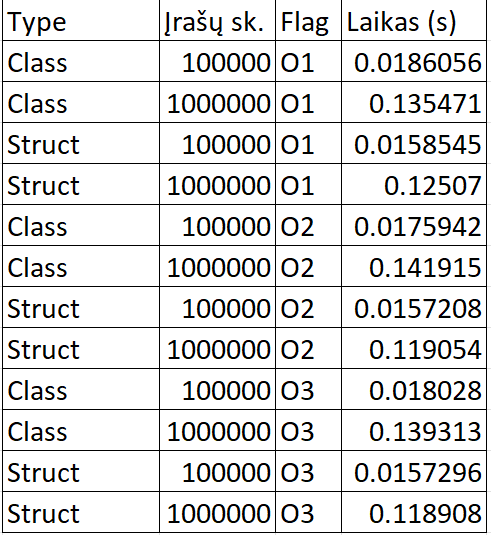

# v1.2

## Realizuota:

* Rule of Five: copy cons., copy assign., move cons., move assign., destructor
* Perkrauti įvedimo, išvedimo operatoriai (>>, <<)
* Rankinis Rule of Five ir perkrautų operatorių testavimas (pateikta nuotrauka: rankinė įvestis, išvestis į ekraną)

## Duomenų įvestis

* Rankinė įvestis (std::cin)
* Automatinė įvestis (pvz.: std::stringstream) 
* Įvestis iš failo (std::ifstream)

## Duomenų išvestis

* Į ekraną (std::cout)
* Į failą (std::ofstream)

